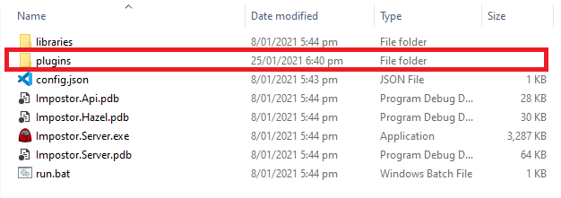

# Zero Kill Cooldown

Impostor server mod that reduces the kill cooldown to zero seconds. 

## How to install 
1. Download and install Impostor server v1.2.2 or newer. This mod was built for Among Us version 2020.9.22
2. Put the AmongUsZeroKillCooldown.dll in the plugins folder of Impostor server

3. Make sure the clients have followed the client instructions and have typed the correct IP address of your server 
4. Have fun!

## How to make mods
If you want to learn how to make mods like this check out my youtube tutorial series: [here](https://youtube.com/playlist?list=PL9f3279OqtNpAoYh3GgKmUjbszIS-ObEb) 

I also stream development of mods live on [twitch](https://www.twitch.tv/LogonDev)